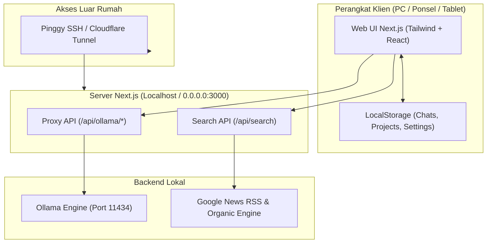

# Panduan Lengkap & Dokumentasi Arsitektur: Ollama Local AI Chat Web

Dokumentasi komprehensif mengenai seluruh fitur, arsitektur, instalasi, mesin pencari web presisi bawaan (Google News & Organic), dan cara akses aplikasi chat lokal Ollama dari mana saja.

---

## Daftar Isi
1. [Ringkasan Proyek](#ringkasan-proyek)
2. [Fitur-Fitur Utama](#fitur-fitur-utama)
3. [Arsitektur Sistem & Alur Kerja](#arsitektur-sistem--alur-kerja)
4. [Panduan Instalasi & Menjalankan Aplikasi](#panduan-instalasi--menjalankan-aplikasi)
5. [Mesin Pencari Web Built-in (Google News & Organic)](#mesin-pencari-web-built-in-google-news--organic)
6. [Panduan Akses Jaringan (Lokal Wi-Fi & Luar Rumah)](#panduan-akses-jaringan-lokal-wi-fi--luar-rumah)
7. [Struktur Folder Proyek](#struktur-folder-proyek)

---

## Ringkasan Proyek

Aplikasi ini adalah antarmuka web modern, cepat, privat, dan *local-first* untuk menjalankan berbagai model LLM lokal via **Ollama** (seperti *Qwythos*, *Llama 3*, *DeepSeek R1*, *Qwen 2.5 Coder*, *LLaVA Vision*, dll.) yang diperkaya dengan fitur-fitur setara platform AI terkemuka seperti **Claude Projects** dan **Perplexity Web Search**.

### Teknologi yang Digunakan:
- **Frontend / Fullstack**: [Next.js 14](https://nextjs.org/) (App Router), React 18, TypeScript.
- **Styling & UI**: Tailwind CSS, Lucide Icons, KaTeX (LaTeX Math), React Markdown.
- **AI Engine**: [Ollama](https://ollama.ai/) REST API (Streaming NDJSON).
- **Search Engine**: Built-in Zero-Config (Google News RSS + Organic Bing + Deep Page Reader).
- **Storage**: *Local-first* (Browser LocalStorage) dengan fitur Backup/Restore JSON.
- **Tunneling**: SSH Port 443 Tunnel + QR Code Generator.

---

## Fitur-Fitur Utama

### 1. Multi-Model Cloud AI API Support (Gemini, Claude, GPT, DeepSeek, Groq)
- **Dukungan Model Cloud Terlengkap**: Beralih bebas antara model lokal Ollama dan model cloud teratas:
  - **Google Gemini**: Gemini 2.5 Flash, Gemini 2.5 Pro, Gemini 2.0 Flash.
  - **OpenAI**: GPT-4o, GPT-4o Mini, o3-mini (Reasoning).
  - **Anthropic Claude**: Claude 3.7 Sonnet (Hybrid Reasoning), Claude 3.5 Sonnet, Claude 3.5 Haiku.
  - **DeepSeek**: DeepSeek-V3 (MoE 671B), DeepSeek-R1 (Full Chain-of-Thought).
  - **Groq LPU**: Llama 3.3 70B & DeepSeek-R1 Distill (Kecepatan 300+ tokens/s).
  - **Custom OpenAI-Compatible API**: Masukkan Base URL + API Key kustom (untuk vLLM, LM Studio, OpenRouter, LocalAI).
- **Pengaturan API Key Terpadu**: Di tab *Settings -> Cloud AI Models* dengan ikon sembunyikan/tampilkan password.

---

### 2. Gelembung Chat Imersif & Blok Penalaran (Reasoning `<think>`)
- **Desain Chat Bubble Modern & Imersif**: Sudut membulat modern, aksen border halus, bayangan kedalaman, dan tipografi rapi.
- **Accordion "Thought Process / Reasoning"**: Secara otomatis mendeteksi tag `<think>...</think>` (pada model seperti DeepSeek-R1, Claude 3.7 Sonnet, Qwen 2.5, Mythos) dan menampilkannya dalam kotak accordion yang bisa dilipat/dibuka.
- **Badge Penyedia Model**: Menampilkan logo dan warna khas untuk Gemini, OpenAI, Claude, DeepSeek, Groq, dan Local Ollama.
- **Tombol Selector Mengikuti Tema Aktif**: Tombol pemilihan model dan dropdown 100% bereaksi terhadap tema warna yang dipilih (*Midnight*, *OLED*, *Light*, *Cyberpunk*, *Forest*, *Sunset*, *Nord*).

---

### 3. Sinkronisasi Real-Time Multi-Device & Server Database
- **Penyimpanan Terpusat di Server Disk (`data/db.json`)**: Riwayat percakapan, Project, AI Agent, dan Pengaturan kini tersimpan di database server lokal.
- **Sinkron Otomatis Antar Perangkat**: Chat yang Anda lakukan di PC akan otomatis muncul saat Anda membuka web di HP, tablet, atau browser lain tanpa perlu export/import manual!
- **Auto-Sync saat Fokus & Background (8 detik)**: Ketika Anda membuka browser HP, aplikasi langsung menyinkronkan pesan-pesan terbaru dari PC secara mulus.
- **Migrasi Otomatis**: Riwayat chat lama di browser Anda otomatis diunggah ke database server pusat pada pembukaan pertama.

---

### 4. Metrik Kecepatan Generasi (Tokens/s & TPS)
- **Live Streaming TPS**: Menampilkan kecepatan generasi token secara real-time (`38.2 t/s`) yang berkedip saat model sedang mengetik.
- **Statistik Presisi Mesin Ollama**: Dihitung langsung dari *nanosecond timer* mesin internal Ollama setelah generasi selesai:
  $$\text{Kecepatan (TPS)} = \frac{\text{eval\_count}}{\text{eval\_duration} \times 10^{-9}}$$
- **Kartu Inspeksi Performa Detail**: Klik badge kecepatan pada pesan asisten untuk melihat:
  - *Generation Speed* (tokens/s)
  - *Total Generated Tokens*
  - *Total Latency / Execution Time* (detik)
  - *Prompt Processing Speed* (prompt tokens/s)
  - *Prompt Token Count*

---

### 5. AI Agentic & Otomasi Terjadwal (Scheduled AI Agents)
- **Tab Khusus di Sidebar**: Navigasi 3 tab modern di sidebar (**Chats**, **Projects**, dan **Agents**).
- **Penjadwalan Fleksibel**:
  - *Harian pada Jam Tertentu*: Misal otomatis jalan setiap pagi jam `08:00`.
  - *Interval Berulang*: Misal jalan otomatis setiap `30 menit`, `1 jam`, `6 jam`, atau `24 jam`.
  - *Manual (On-Demand)*: Eksekusi seketika kapan pun dengan tombol **"Run Now"**.
- **Pencarian Web Otonom (Built-in Precision)**: Agen AI dapat browsing internet secara mandiri untuk mengumpulkan data fakta sebelum menulis laporan.
- **Routing Output ke Project**: Hasil eksekusi agen dapat otomatis disimpan ke Project tertentu atau ke chat baru dengan badge khusus `Agent`.
- **Log Riwayat & Notifikasi**: Menyimpan riwayat eksekusi (durasi, jumlah token, status) dan memicu notifikasi desktop ketika tugas selesai.
- **Template Siap Pakai**: *Morning AI News Digest*, *Crypto & Market Pulse*, *Daily Startup Ideas*, *Productivity Planner*.

---

### 6. Akses File & Disk Lokal (Local Disk Explorer)
- **Penjelajah Disk Langsung (`/api/fs`)**: Jelajahi folder dan drive komputer Anda (`C:\`, `D:\`, folder Documents, Downloads, repository kode, dll.) langsung dari antarmuka web tanpa perlu upload ke cloud.
- **Deteksi Otomatis File Teks & Source Code**: Mendukung `.py`, `.js`, `.ts`, `.json`, `.md`, `.txt`, `.sql`, `.java`, `.cpp`, `.rs`, `.go`, `.html`, `.css`, `.env`, `.yaml`, dll.
- **Aksi 1-Klik**:
  - *+ Attach to Chat*: Lampirkan file disk ke percakapan saat ini.
  - *+ Add to Project*: Masukkan file disk ke dalam Knowledge Base Project Claude secara permanen.
  - *Ask AI*: Langsung tanyakan ringkasan, analisis bug, atau penjelasan isi file ke model Ollama.

---

### 7. Claude-Style Projects & Persistent Knowledge Base
- **Workspace Terisolasi**: Buat project khusus (misal: *Fullstack Next.js*, *Python Data Science*, *Penerjemah Bahasa*, *Analisis Dokumen Hukum*).
- **Instruksi Kustom per Project**: System prompt khusus yang otomatis diterapkan ke seluruh chat di dalam project tersebut.
- **Knowledge Base Permanen**: Unggah dokumen referensi (`.pdf`, `.txt`, `.md`, `.json`, `.py`, `.ts`, `.csv`, dll.) ke dalam project. Semua chat di project tersebut otomatis memiliki ingatan dan akses terhadap isi file-file tersebut.
- **Preferensi Model & Hyperparameter**: Tentukan model default dan *Temperature* khusus per project.

---

### 8. Live Web Search Built-in Presisi Tinggi (RAG)
- **Toggle "Search ON / OFF"**: Tombol bola dunia di samping kolom input chat.
- **Pencarian Multi-Engine Real-Time**: Mengambil berita aktual dari Google News RSS (lengkap dengan tanggal dan nama penerbit) serta informasi spesifik melalui mesin organik & Wikipedia tanpa perlu Docker atau konfigurasi eksternal.
- **Grounding Context**: Hasil pencarian disuntikkan ke prompt Ollama untuk menjawab pertanyaan berbasis fakta terkini.
- **Sitasi Sumber yang Dapat Diklik**: Menampilkan daftar sumber referensi artikel lengkap dengan judul, domain, dan link aktif.

---

### 9. Input Multimodal (Gambar, Dokumen & Source Code)
- **Model Vision**: Dukungan format `.png`, `.jpg`, `.jpeg`, `.webp`, `.gif` yang otomatis diubah ke Base64 untuk model vision Ollama (misal: LLaVA, Llama 3.2 Vision).
- **Dokumen & Kode**: Dukungan file teks (`.pdf`, `.txt`, `.md`, `.json`, `.csv`, `.py`, `.js`, `.ts`, `.html`, `.css`, `.sql`, `.env`, dll.).
- **3 Metode Input File**:
  1. Tombol Paperclip file picker.
  2. Paste langsung dari clipboard (`Ctrl + V`).
  3. Drag & Drop file ke jendela chat.
- **Galeri Pratinjau**: Thumbnail gambar dengan fitur *fullscreen preview* modal.

---

### 10. Tampilan Responsif & Native Mobile Viewport
- **Fit Layar HP Otomatis**: Menggunakan konfigurasi `interactiveWidget: "resizes-content"` dan `100dvh` sehingga tampilan otomatis pas 100% tanpa perlu menyalakan *"Situs Desktop"* di browser ponsel.
- **Keyboard-Adaptive**: Kolom input dan tombol kirim tidak akan tertutup saat keyboard virtual HP muncul.
- **Anti-Zoom Safari/Chrome**: Ukuran font input disesuaikan agar tidak memicu zoom otomatis saat disentuh.
- **Drawer Sidebar Seluler**: Navigasi sidebar overlay yang fleksibel dengan penutup otomatis saat berpindah chat.

---

### 11. 8 Pilihan Tema & Ikon Aplikasi
- **Pilihan Tema**: *Midnight Dark*, *OLED Black (Pitch Black)*, *Clean Light*, *Cyberpunk Neon*, *Forest Emerald*, *Sunset Amber*, *Nord Arctic*, dan *System Auto*.
- **Favicon & App Icon Vektor (SVG)**: Logo robot AI modern pada tab browser dan layar utama HP (*Add to Home Screen*).

---

## Arsitektur Sistem & Alur Kerja



---

## Panduan Instalasi & Menjalankan Aplikasi

### 1. Prasyarat:
- [Node.js](https://nodejs.org/) v18+ atau v20+
- [Ollama](https://ollama.ai/) berjalan di latar belakang (`http://localhost:11434`)

### 2. Menjalankan Server Pengembangan:
```powershell
cd <path-ke>/castalia
npm run dev
```
Aplikasi akan aktif di:
- **PC Lokal**: `http://localhost:3000`
- **Jaringan Wi-Fi Rumah**: `http://192.168.1.101:3000`

---

## Mesin Pencari Web Built-in (Google News & Organic)

Sistem menggunakan **Built-in Precision Web Engine** mandiri yang terintegrasi langsung di aplikasi tanpa memerlukan Docker atau konfigurasi tambahan (*zero-config*):

### 1. Klasifikasi Intent Cerdas (*Intent Routing*):
- **Berita & Aktualita (`intent: news`)**: Mengambil artikel aktual dari **Google News RSS**, menyertakan stempel waktu terbit (`pubDate`) dan nama media resmi (misal: *OJK*, *Detik*, *Kompas*, *BleepingComputer*).
- **Keamanan Siber & CVE (`intent: security`)**: Mengisolasi kode advisory NVD/CVE dan domain otoritas keamanan (`cve.org`, `nvd.nist.gov`, dll).
- **Hardware & Produk (`intent: hardware`)**: Merestrukturisasi kueri spesifikasi dan harga laptop/gadget dengan subject noun di awal kueri.
- **Konsep & Dokumentasi (`intent: coding / general`)**: Pencarian referensi web dan Wikipedia secara terarah.

### 2. Deep Webpage Reader Mode:
- Mengambil isi teks artikel secara mendalam (`maxChars: 2500`) menggunakan parser konten utama dan isolasi tag `<article>` / `<main>` sehingga model lokal Ollama dapat membaca seluruh isi artikel.

### 3. Universal Spam Blacklist:
- Secara otomatis memfilter dan membuang hasil kamus definisi kata (KBBI, *arti kata*, *pronomina*), template surat lamaran/rekomendasi, dan spam portal lainnya.

---

## Panduan Akses Jaringan (Lokal Wi-Fi & Luar Rumah)

### 1. Buka Blokir Windows Firewall (Untuk Wi-Fi Lokal `192.168.1.101:3000`)
Jalankan **sekali saja** di **PowerShell (Run as Administrator)**:
```powershell
New-NetFirewallRule -DisplayName "Ollama Chat Web Port 3000" -Direction Inbound -LocalPort 3000 -Protocol TCP -Action Allow
```

---

### 2. Akses dari Luar Rumah via Public Tunnel
Buka terminal PowerShell baru dan jalankan skrip tunnel:
```powershell
cd <path-ke>/castalia
npm run tunnel
```
- Terminal akan menghasilkan **Public HTTPS URL** dan **QR Code**.
- Scan QR Code menggunakan kamera HP untuk langsung membuka chat dari jaringan seluler di luar rumah tanpa konfigurasi tambahan!

---

## Local App Bridge — Framework untuk Koneksi ke Aplikasi Lokal

Beberapa use-case butuh menghubungkan aplikasi web ini ke aplikasi desktop lain yang berjalan di komputer yang sama, lewat HTTP bridge lokal (misalnya: daemon Python custom yang mengontrol Blender lewat `bpy`, atau app desktop lain apapun yang punya HTTP server sendiri). **Catatan: tidak ada bridge bawaan/pre-built untuk aplikasi manapun** — `DEFAULT_CONNECTORS` di `lib/directoryData.ts` sengaja dikosongkan; semua per-service hardcoded logic (GitHub API, Slack/Discord webhook shaping, Blender bpy bridge) sudah dihapus dari `app/api/connectors/route.ts`. `lib/localAppBridge.ts` adalah lapisan generic yang user pakai untuk mendefinisikan bridge-nya sendiri lewat Directory > Connectors > Add Custom Bridge:

1. **Token otentikasi per-instalasi** — token acak (`crypto.randomBytes(24)`) dibuat sekali saat bridge di-install, disimpan di `data/<bridge-id>-bridge-token.json`, dan dikirim di setiap request lewat header `X-Bridge-Token`.
2. **SSRF guard loopback-only** — `assertLoopbackOnlyUrl()` (di `lib/ssrfGuard.ts`) memastikan URL bridge selalu `127.0.0.1`/`::1`, tidak pernah alamat LAN atau publik. Ini penting karena bridge biasanya menerima perintah yang powerful (eksekusi kode, kontrol aplikasi) — kalau bisa diakses dari luar loopback, itu jadi RCE terbuka.
3. **Test koneksi** dengan timeout, untuk cek bridge hidup atau tidak sebelum mengirim perintah.
4. **Eksekusi aksi** dengan fallback endpoint, timeout, dan pembedaan jelas antara "bridge menolak karena token salah" (401) vs "bridge memang mati/tidak terjangkau".
5. **Fallback offline** — kalau bridge mati, caller dapat payload yang tadinya mau dikirim, supaya bisa dijalankan manual oleh user di aplikasi tujuannya.

### Yang TIDAK digeneralisasi (tetap tanggung jawab user per-bridge)

- Instalasi startup-script (path OS-specific, kalau aplikasi tujuan punya mekanisme "jalankan script ini saat startup"). Ini murni contoh/dokumentasi untuk user yang mau bikin sendiri — tidak ada instalasi otomatis bawaan aplikasi ini untuk aplikasi manapun.
- Isi script/payload yang dikirim ke bridge — sepenuhnya tergantung format yang diterima aplikasi tujuan user.
- Port default dan path endpoint — masing-masing bridge mendefinisikan `BridgeDefinition` sendiri saat user menambahkannya.

### Cara menambahkan bridge baru

Semua bridge — termasuk ke aplikasi seperti Blender — dibuat sepenuhnya oleh user lewat Directory > Connectors > Add Custom Bridge; tidak ada bridge bawaan untuk aplikasi tertentu yang sudah ditulis di `app/api/connectors/route.ts`. Contoh skeleton untuk bridge baru:

```typescript
import { BridgeDefinition, testBridgeConnection, executeBridgeAction, generateAndStoreBridgeToken } from "@/lib/localAppBridge";

const OBS_BRIDGE: BridgeDefinition = {
  id: "obs-studio",
  displayName: "OBS Studio",
  defaultUrl: "http://127.0.0.1:4455", // OBS WebSocket default port
  executePath: "/request",
  timeoutMs: 3000,
};

// Saat user klik "Connect" di UI:
const { reachable, details } = await testBridgeConnection(OBS_BRIDGE, userProvidedUrl);

// Saat user minta aksi (misal: mulai recording):
const result = await executeBridgeAction(OBS_BRIDGE, userProvidedUrl, {
  requestType: "StartRecord",
});
if (result.isBridgeOffline) {
  // tampilkan pesan "OBS tidak terjangkau, pastikan OBS WebSocket server aktif"
} else if (result.isAuthRejected) {
  // tampilkan pesan "token salah, cek pengaturan OBS WebSocket"
} else if (result.success) {
  // tampilkan result.message
}
```

Test suite framework ini ada di `tests/localAppBridge.test.ts` (18 test — lifecycle token, fallback endpoint, deteksi 401 vs offline, SSRF guard).

## Struktur Folder Proyek

```text
castalia/
├── app/
│   ├── api/
│   │   ├── ollama/[...path]/route.ts  # Proxy streaming Ollama API (tanpa isu CORS)
│   │   └── search/route.ts            # Handler API Web Search presisi built-in
│   ├── globals.css                    # Definisi variabel CSS 8 tema & scroll
│   ├── icon.svg                       # Favicon vektor dinamis Next.js
│   ├── layout.tsx                     # Metadata, viewport cover, & anti-zoom
│   └── page.tsx                       # State utama, lifecycle chat, & RAG
├── components/
│   ├── ChatArea.tsx                   # Workspace chat & banner status project
│   ├── ChatInput.tsx                  # Input bar, attachment picker, & toggle Search
│   ├── ChatMessage.tsx                # Render pesan, KaTeX, TPS stats, & sitasi web
│   ├── CodeBlock.tsx                  # Syntax highlighter & tombol salin kode
│   ├── ModelSelector.tsx              # Dropdown model Ollama dinamis
│   ├── ParametersDrawer.tsx           # Pengaturan suhu, Top-P, & preset persona
│   ├── ProjectModal.tsx               # Editor Claude-style Project & Knowledge Base
│   ├── SettingsModal.tsx              # Pengaturan server Ollama, search, & tema
│   └── Sidebar.tsx                    # Navigasi riwayat chat, pencarian, & tab Projects
├── lib/
│   ├── constants.ts                   # Nilai default setting, prompt, & tema
│   ├── fileUtils.ts                   # Parser file base64 & ekstraktor teks dokumen
│   ├── ollama.ts                      # Klien API Ollama, streaming reader, & TPS
│   ├── storage.ts                     # LocalStorage persistence & backup/restore
│   └── types.ts                       # Definisi TypeScript (Message, Project, dll.)
├── public/
│   └── favicon.svg                    # Vector app icon
├── scripts/
│   └── tunnel.mjs                     # Skrip high-speed SSH tunnel & QR code
├── package.json                       # Dependencies & npm scripts
├── tsconfig.json                      # Konfigurasi TypeScript
└── DOCUMENTATION.md                   # Dokumen panduan ini
```
