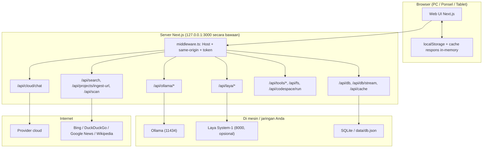

# Panduan & Dokumentasi Arsitektur — Lyra

Panduan instalasi, arsitektur, pencarian web bawaan, dan akses jaringan untuk Lyra, antarmuka chat *local-first* untuk model Ollama (dan provider cloud). Untuk katalog fitur per-subsistem, lihat [FEATURES.md](FEATURES.md); untuk ringkasan singkat dan keamanan, lihat [README.md](README.md).

## Daftar Isi
1. [Ringkasan Proyek](#ringkasan-proyek)
2. [Fitur Utama](#fitur-utama)
3. [Arsitektur](#arsitektur)
4. [Instalasi & Menjalankan](#instalasi--menjalankan)
5. [Pencarian Web Bawaan](#pencarian-web-bawaan)
6. [Akses dari Perangkat Lain & dari Luar Rumah](#akses-dari-perangkat-lain--dari-luar-rumah)
7. [Local App Bridge](#local-app-bridge)
8. [Struktur Folder](#struktur-folder)

---

## Ringkasan Proyek

Aplikasi web untuk satu pengguna yang menjalankan model lokal via **Ollama** (atau provider cloud yang kompatibel) dengan konteks RAG dari berkas proyek Anda, pencarian web, agen terjadwal, dan alat disk yang dijaga persetujuan.

**Teknologi:**
- **Fullstack**: [Next.js 14](https://nextjs.org/) (App Router, Route Handlers), React 18, TypeScript.
- **UI**: Tailwind CSS, `@phosphor-icons/react`, KaTeX, React Markdown.
- **AI**: Ollama REST API (streaming NDJSON) dan provider cloud lewat proxy `/api/cloud/chat`. Daftar model preset ada di `lib/constants.ts`.
- **Penyimpanan**: database server di folder `data/` (SQLite via `better-sqlite3` bila tersedia, jika tidak berkas `data/db.json`). Browser menyimpan cache sisi klien dan pengaturan UI di `localStorage`, dan keduanya disinkronkan.
- **Pencarian**: scraper bawaan tanpa API key (lihat [bagian 5](#pencarian-web-bawaan)).
- **Tunnel**: SSH ke Pinggy + kode QR (`npm run tunnel`).

---

## Fitur Utama

| Area | Ringkasan | Detail |
|---|---|---|
| Chat | Streaming (error di tengah stream ditampilkan), edit/regenerate/branch, blok `<think>`, input gambar (Ollama dan provider cloud) & dokumen, antrean pesan | FEATURES §1 |
| Model | Ollama lokal + OpenAI, Anthropic, Gemini, Groq, DeepSeek, OpenRouter, endpoint OpenAI-kompatibel kustom | FEATURES §1.1 |
| Inferensi | Bucket konteks, sampling adaptif, *prefix pinning*, pembongkaran model embedding, (opsional) Laya System-1 | FEATURES §2 |
| RAG | BM25 + vektor dengan RRF, re-ranking, *stitching* chunk, verifikator sitasi, *folder watcher* | FEATURES §3 |
| Codespace | Pyodide di browser atau subproses server | FEATURES §4 |
| Tools & agen | `read_file`/`write_file`/dll. dengan *approval gate* dan revert; agen terjadwal | FEATURES §5–6 |
| Memori | Ekstraksi fakta durable dengan penyaringan kredensial | FEATURES §7 |
| Pencarian web | Google News RSS, Bing, DuckDuckGo, Wikipedia, pembaca halaman | FEATURES §8 |
| Suara | Web Speech API + `speechSynthesis` | FEATURES §9 |
| Cache & sinkronisasi | Cache respons dua tingkat; sinkronisasi antar-tab/perangkat via SSE | FEATURES §10 |
| Workspace | Projects, Journal, Knowledge Graph, 13 tema + palet kustom | FEATURES §11 |
| Keamanan | Allowlist `Host`, wajib same-origin, token opsional, SSRF, sandbox path | FEATURES §12, README, [SECURITY.md](SECURITY.md) |

Sinkronisasi multi-perangkat: data percakapan, project, agen, dan pengaturan disimpan di server; perubahan disiarkan lewat Server-Sent Events (`/api/db/stream`, server memeriksa nomor versi tiap 2 detik lewat `readServerDbVersion()` tanpa memuat seluruh database) sehingga tab/perangkat lain memuat ulang saat ada perubahan. Riwayat lama di browser diunggah otomatis pada pembukaan pertama.

---

## Arsitektur


```mermaid
graph TD
    subgraph Klien ["Browser (PC / Ponsel / Tablet)"]
        UI["Web UI Next.js"]
        Local["localStorage + cache respons in-memory"]
    end

    subgraph Server ["Server Next.js (127.0.0.1:3000 secara bawaan)"]
        MW["middleware.ts: Host + same-origin + token"]
        OllamaProxy["/api/ollama/*"]
        LayaProxy["/api/laya/*"]
        Cloud["/api/cloud/chat"]
        Search["/api/search, /api/projects/ingest-url, /api/scan"]
        Tools["/api/tools/*, /api/fs, /api/codespace/run"]
        DB["/api/db, /api/db/stream, /api/cache"]
    end

    subgraph Backend ["Di mesin / jaringan Anda"]
        Ollama["Ollama (11434)"]
        Laya["Laya System-1 (8000, opsional)"]
        Disk["SQLite / data/db.json"]
    end

    subgraph Internet
        Providers["Provider cloud"]
        Web["Bing / DuckDuckGo / Google News / Wikipedia"]
    end

    UI --> MW
    MW --> OllamaProxy --> Ollama
    MW --> LayaProxy --> Laya
    MW --> Cloud --> Providers
    MW --> Search --> Web
    MW --> Tools
    MW --> DB --> Disk
    UI <--> Local
```

Semua permintaan ke `/api/*` melewati `middleware.ts`. Permintaan keluar yang dipengaruhi input tidak tepercaya (webhook, scraping, pemindai OWASP) memakai `lib/safeFetch.ts`.

---

## Instalasi & Menjalankan

### Prasyarat
- [Node.js](https://nodejs.org/) **20.19+** (22 LTS disarankan: backend SQLite membutuhkan Node 22, dan TypeScript di Codespace membutuhkan 22.6+; di Node 20 data disimpan di `data/db.json`).
- [Ollama](https://ollama.com/) berjalan (`http://127.0.0.1:11434`).

### Menjalankan
```bash
git clone https://github.com/p3nr0s3/lyra.git
cd lyra
npm install
cp .env.example .env.local     # opsional, lihat di bawah
npm run dev                     # atau: npm run dev:all (sekaligus Laya)
```
Buka <http://localhost:3000>. Mode produksi: `npm run build && npm start`.

Repositori menyertakan `.npmrc` dengan `ignore-scripts=true` agar binary prebuilt `better-sqlite3` dipakai langsung (tanpa ini `npm install` mencoba mengompilasinya dan, bila tidak ada toolchain C++, diam-diam membuangnya).

### Variabel lingkungan (`.env.local`)
| Variabel | Fungsi |
|---|---|
| `APP_ACCESS_TOKEN` + `NEXT_PUBLIC_APP_ACCESS_TOKEN` | Token bearer untuk `/api/*` (nilai keduanya harus sama; yang `NEXT_PUBLIC_` dibundel ke browser, jadi ini pengunci pintu, bukan rahasia). Wajib untuk `*:lan` dan tunnel. |
| `ALLOWED_HOSTS` | Hostname tambahan yang boleh dipakai untuk mengakses aplikasi (mis. reverse proxy). |
| `OLLAMA_HOST` | Alamat Ollama bawaan. |
| `ANTHROPIC_API_KEY`, `GEMINI_API_KEY`, `OPENAI_API_KEY`, `GROQ_API_KEY`, `DEEPSEEK_API_KEY`, `OPENROUTER_API_KEY` | Menyimpan key provider di sisi server (lebih diutamakan daripada key yang diketik di Settings). |
| `ALLOW_EXTERNAL_ORIGIN` | Mengizinkan satu origin eksternal memanggil API lintas-origin. |

### Skrip
| Perintah | Fungsi |
|---|---|
| `npm run dev` / `npm start` | Bind ke `127.0.0.1` saja. |
| `npm run dev:lan` / `npm run start:lan` | Bind ke `0.0.0.0` (jaringan lokal). **Menolak berjalan tanpa `APP_ACCESS_TOKEN`** (override sadar: `ALLOW_OPEN_LAN=1`). |
| `npm run dev:all`, `start:all`, `prod:all` (+ `:lan`) | Menyalakan Lyra dan Laya System-1 sekaligus (`scripts/launch.mjs`). |
| `npm run tunnel` | Tunnel publik (lihat bawah). |
| `npm test`, `npm run typecheck`, `npm run verify` | Vitest, `tsc --noEmit`, dan ketiganya + build produksi (yang dijalankan CI di `.github/workflows/ci.yml`). |

---

## Pencarian Web Bawaan

Mesin pencari bawaan (`lib/webSearchEngine.ts`, rute `app/api/search/route.ts`) tidak butuh Docker atau API key.

**Perutean intent** menentukan sumber:
- **Berita** (`news`): Google News RSS (dengan `pubDate` dan nama penerbit), dilengkapi hasil organik.
- **Keamanan/CVE** (`security`): memprioritaskan domain otoritas seperti `cve.org` dan `nvd.nist.gov`.
- **Hardware/produk** (`hardware`): menyusun ulang kueri spesifikasi/harga.
- **Konsep/dokumentasi** (`coding`/`general`): hasil organik (Bing + DuckDuckGo) dan Wikipedia.

**Pembaca halaman**: `scrapePageContent` mengambil teks artikel (`<article>`/`<main>`, bawaan 2500 karakter, 4000 untuk mode URL langsung) lewat `safeFetch`; bila halaman tampak sebagai SPA, fallback ke Jina Reader (`r.jina.ai`, layanan pihak ketiga — URL yang ditolak guard SSRF tidak diteruskan ke sana).

**Filter spam**: hasil kamus definisi kata, templat surat, dan portal spam dibuang.

Hasil pencarian disuntikkan ke prompt sebagai konteks dan ditampilkan sebagai sitasi yang dapat diklik.

---

## Akses dari Perangkat Lain & dari Luar Rumah

### Jaringan lokal (Wi-Fi)
1. Setel `APP_ACCESS_TOKEN` dan `NEXT_PUBLIC_APP_ACCESS_TOKEN` di `.env.local`.
2. Jalankan `npm run dev:lan` (atau `start:lan`) — `npm run dev` biasa **tidak** dapat dijangkau dari perangkat lain.
3. Di Windows, buka port sekali saja (PowerShell *Run as Administrator*):
   ```powershell
   New-NetFirewallRule -DisplayName "Lyra Port 3000" -Direction Inbound -LocalPort 3000 -Protocol TCP -Action Allow
   ```
4. Buka `http://<IP-PC>:3000` dari perangkat lain. Akses lewat IP atau nama satu-label/`.local` diterima; nama domain lain harus didaftarkan di `ALLOWED_HOSTS`.

### Dari luar rumah (tunnel)
```bash
npm run tunnel
```
Skrip menolak berjalan bila `APP_ACCESS_TOKEN` belum disetel (dibaca dari lingkungan atau `.env.local`). Setelah tersambung ia menampilkan URL HTTPS Pinggy dan kode QR. Jaga terminal tetap terbuka; `Ctrl+C` menutup tunnel. Siapa pun yang memegang URL dan token dapat memakai fitur aplikasi (termasuk baca file di home dan eksekusi kode), jadi gunakan token yang kuat (`openssl rand -hex 32`) dan putar ulang jika curiga bocor.

---

## Local App Bridge

Untuk menghubungkan aplikasi ini ke aplikasi desktop lain di komputer yang sama lewat HTTP lokal (mis. daemon Python yang mengontrol Blender). **Tidak ada bridge bawaan untuk aplikasi mana pun**: `DEFAULT_CONNECTORS` di `lib/directoryData.ts` sengaja kosong dan `app/api/connectors/route.ts` tidak lagi mengetahui API pihak ketiga. `lib/localAppBridge.ts` adalah lapisan generik; Anda mendefinisikan bridge lewat Directory > Connectors > Add Custom Bridge.

1. **Token per-instalasi** — `crypto.randomBytes(24)`, disimpan di `data/<bridge-id>-bridge-token.json`, dikirim sebagai header `X-Bridge-Token`.
2. **Hanya loopback** — `assertLoopbackOnlyUrl()` (`lib/ssrfGuard.ts`) memastikan endpoint bridge me-resolve ke `127.0.0.0/8` atau `::1` saja; bridge biasanya menerima perintah berdaya besar.
3. **Uji koneksi** dengan timeout sebelum mengirim perintah.
4. **Eksekusi aksi** dengan endpoint cadangan, timeout, dan pembedaan antara "token ditolak" (401) dan "bridge mati".
5. **Fallback offline** — bila bridge mati, pemanggil menerima payload agar bisa dijalankan manual.

Connector bertipe *webhook* mengirim POST JSON ke URL publik saja (`assertPublicUrl` + `safeFetch`).

Yang tetap menjadi tanggung jawab Anda: skrip *startup* di aplikasi tujuan, format payload, serta port dan path endpoint (`BridgeDefinition` per-bridge). Contoh:

```typescript
import { BridgeDefinition, testBridgeConnection, executeBridgeAction } from "@/lib/localAppBridge";

const OBS_BRIDGE: BridgeDefinition = {
  id: "obs-studio",
  displayName: "OBS Studio",
  defaultUrl: "http://127.0.0.1:4455",
  executePath: "/request",
  timeoutMs: 3000,
};

const { reachable } = await testBridgeConnection(OBS_BRIDGE, userProvidedUrl);
const result = await executeBridgeAction(OBS_BRIDGE, userProvidedUrl, { requestType: "StartRecord" });
if (result.isBridgeOffline) { /* bridge tidak terjangkau */ }
else if (result.isAuthRejected) { /* token salah */ }
else if (result.success) { /* result.message */ }
```

Test suite: `tests/localAppBridge.test.ts` (18 test — siklus token, endpoint cadangan, 401 vs offline, guard loopback).

---

## Struktur Folder

```text
lyra/
├── app/
│   ├── api/                     # Route Handlers: cache, cloud, codespace, connectors, db, fs,
│   │                            #   laya, memory, ollama, projects, scan, search, tools
│   ├── codespace/page.tsx       # Halaman Codespace
│   ├── globals.css              # Variabel CSS tema
│   ├── layout.tsx               # Metadata, viewport, font
│   └── page.tsx                 # State utama, siklus chat, RAG
├── components/                  # UI: ChatArea, ChatInput, ChatMessage, SettingsModal, Sidebar, ...
├── lib/
│   ├── ollama.ts, rag.ts, embeddings.ts, adaptiveSampling.ts   # inferensi & RAG
│   ├── requestGuard.ts          # logika Host / same-origin / token (Edge-safe)
│   ├── ipPolicy.ts, ssrfGuard.ts, safeFetch.ts, proxyPaths.ts  # SSRF & proxy
│   ├── pathSandbox.ts, toolApproval.ts, diskToolOps.ts         # alat disk & approval
│   ├── redaction.ts, memoryExtractor.ts                        # penyaringan secret
│   ├── cloudVision.ts                                          # gambar → format provider cloud
│   ├── serverDb.ts, responseCache.ts                           # persistensi & cache
│   └── webSearchEngine.ts, fileWatcher.ts, agentEngine.ts, ... # pencarian, watcher, agen
├── middleware.ts                # gerbang permintaan
├── scripts/                     # launch.mjs, tunnel.mjs, warnOpenAccess.mjs, loadEnv.mjs
├── tests/                       # suite Vitest
├── .github/                     # CI (ci.yml) dan Dependabot
├── .env.example, .npmrc, next.config.mjs, package.json
├── README.md, FEATURES.md, DOCUMENTATION.md, SECURITY.md
└── LICENSE
```
