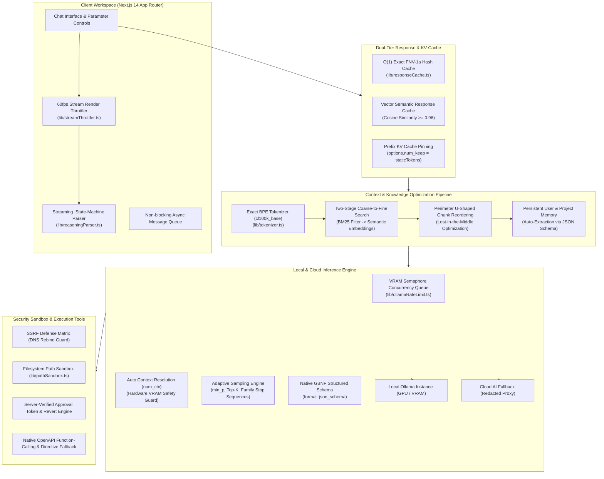
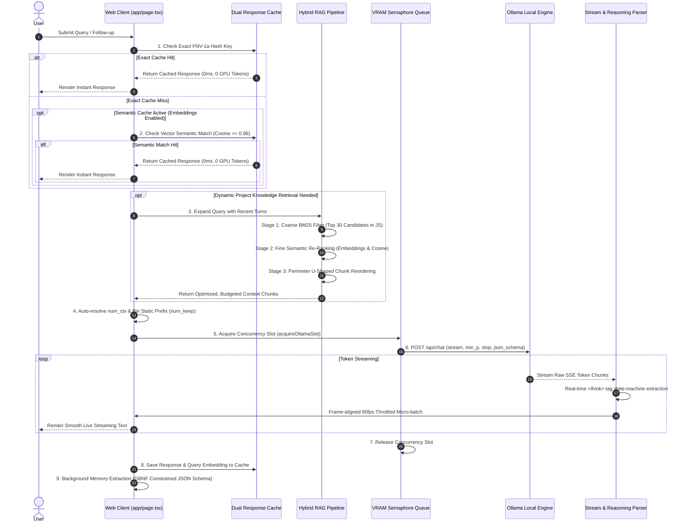

# Ollama Chat Web

<div align="center">

[](https://opensource.org/licenses/MIT)
[](https://nextjs.org/)
[](https://www.typescriptlang.org/)
[](https://ollama.com/)
[](https://vitest.dev/)
[](#security-model)

**A high-performance, local-first AI workspace and agentic development environment built on Next.js 14.**  
Engineered from the ground up for maximum local LLM inference efficiency, GPU VRAM preservation, robust prompt caching, and zero-compromise security boundaries.

[Architecture](#system-architecture) • [Inference Lifecycle](#end-to-end-inference-lifecycle) • [Key Features](#key-features) • [Security](#security-model) • [Quick Start](#quick-start) • [Testing](#testing)

</div>

---

## Overview

**Ollama Chat Web** is not just another UI skin for local models. It is a full-featured AI workspace designed to solve the real-world friction of running models locally: silent context truncation, high latency on prompt re-evaluation, VRAM contention, hallucinations during long chats, and insecure tool execution.

### Why Ollama Chat Web?

- **Zero VRAM Waste & Instant Turnaround**: Automated **KV Cache Prefix Pinning** (`options.num_keep`) keeps static system prompts warm in GPU memory, cutting prompt evaluation delays to zero.
- **Eliminates 2048-Token Silent Truncation**: Automatic **Model Context-Window Resolution** derives native context limits (`num_ctx`) per model family (up to 131K for Llama 3.1 & Qwen 2.5) with local hardware safety ceilings.
- **Stanford Lost-in-the-Middle RAG**: Reorders retrieved chunks into a **U-shaped perimeter** (placing high-relevance chunks at the context boundaries) with two-stage coarse-to-fine hybrid search (BM25 $\to$ Vector Embeddings).
- **Constrained Structured Output Decoding**: Enforces native **JSON Schema Grammar (GBNF)** at the sampler level for reliable machine-readable extraction without markdown preamble or broken JSON.
- **Dual-Tier Response Caching**: Sub-millisecond exact FNV-1a hash matching combined with **Semantic Vector Caching** (Cosine Similarity $\ge 0.96$) to answer repeated or rephrased queries with **0ms GPU latency and 0 tokens generated**.
- **Defensive Security Architecture**: Sandboxed filesystem access, DNS-rebinding-proof SSRF guards, and cryptographically verified **approval tokens with one-click reversibility** on all mutating actions.
- **Silky Smooth 60fps Streaming**: Micro-batched token render throttler prevents browser DOM thrashing during high-speed local inference (60–120+ tokens/sec) while isolating `<think>` reasoning tags in real time.

---

## System Architecture

The workspace is organized into five tightly integrated subsystems that decouple UI interaction, retrieval pipeline, context optimization, and model execution:



---

## End-to-End Inference Lifecycle

Here is the exact step-by-step lifecycle of a user prompt through the optimization and inference pipeline:



---

## Key Features

### 1. Model Inference Efficiency & VRAM Architecture
- **Prefix KV Cache Pinning (`options.num_keep`)**:
  Calculates exact static tokens (personas, persistent memories, tool OpenAPI schemas) using BPE token counting and pins them in GPU memory. Ollama never re-evaluates static system prompt tokens on subsequent turns.
- **Dynamic Context Sizing (`options.num_ctx`)**:
  Eliminates Ollama's default 2048 silent truncation. Auto-resolves native window capabilities via `/api/show` with family fallbacks (131K for Llama 3.1/Qwen 2.5, 65K for DeepSeek, 32K for Mistral) clamped to a safe hardware VRAM ceiling.
- **Dynamic Probability Truncation (`options.min_p`)**:
  Supports `min_p` sampling (`0.05` default), dynamically cutting tokens with probabilities below a fraction of the top token. Dramatically cuts repetition loops and hallucinations without flattening output creativity.
- **Automated Family-Aware Stop Tokens**:
  Automatically injects architecture-specific turn boundaries (`<|eot_id|>`, `<|im_end|>`, `<end_of_turn>`, `\nUser:`, ChatML tokens) preventing multi-turn hallucination loops.
- **In-line Streaming Reasoning Parser**:
  Non-blocking streaming state machine that extracts `<think>` / `</think>` boundaries on the fly (for DeepSeek-R1, QwQ, etc.), routing thoughts into a clean collapsible drawer without UI lag.

### 2. Precision RAG & Hybrid Retrieval
- **Perimeter U-Shaped "Lost in the Middle" Reordering**:
  In accordance with Stanford & Berkeley long-context research, chunks are ordered in a U-shape: Rank #1 at the beginning, Rank #2 at the end (closest to user prompt), and lower-ranked chunks in the middle where LLM attention is weakest.
- **Two-Stage Coarse-to-Fine Retrieval**:
  Runs fast in-memory BM25 filtering across all document chunks first (< 2ms), then sends only the top 30 candidates for embedding cosine calculation. Reduces embedding latency and GPU queue locks by 80–90%.
- **Word-Boundary Overlap Snapping**:
  Document chunking snaps overlap boundaries back to the nearest space or newline, eliminating broken sub-word tokens and garbled BPE splits.
- **Exact BPE Token Accounting**:
  Backed by `js-tiktoken` (`cl100k_base`) with LRU caching, replacing imprecise character heuristics with real token calculations for strict context guard adherence.

### 3. Agentic Capabilities & Sandboxed Tools
- **Hybrid Tool-Calling Architecture**:
  Native Ollama OpenAPI function calling by default, with automatic fallback to structured text directives (`[TOOL_CALL:name:{json}]`) for legacy models or endpoints that reject native tool payloads.
- **Read-Only vs. Mutating Safety Boundary**:
  - *Read-only tools* (`list_directory`, `read_file`, `search_files`, `graphify_*`) execute instantly.
  - *Mutating tools* (`write_file`, `delete_file`) require a cryptographically generated, server-verified approval token.
- **One-Click Reversible Actions**:
  Any approved mutating disk operation can be undone from the approval history. Revert requests verify that the target file has not been modified since the operation to prevent race conditions.
- **Codespace Execution Sandbox**:
  Execute Python, Node.js, PowerShell, or Bash directly from the browser (`/api/codespace/run`) in sandboxed child processes with automatic environment sanitization and temp cleanup.

### 4. Ambient Knowledge & Connected Bridges
- **Ambient Folder Watcher**:
  Project knowledge tabs can sync against live local folders via debounced `fs.watch`, automatically resuming across server reboots.
- **Generic Bridge Connectors**:
  Connect to external webhooks or local desktop applications via loopback-only HTTP bridges (`/bridge <bridge-id> <message>`).

---

## Security Model

Ollama Chat Web treats all local filesystem and network interactions with defensive, multi-layered security controls:

| Security Layer | Mechanism | Protection Scope |
| :--- | :--- | :--- |
| **Authentication & CSRF** | `APP_ACCESS_TOKEN` bearer gate + strict cross-origin rejection | Prevents malicious sites from driving the local API via background tabs. |
| **SSRF Defense Matrix** | `lib/ssrfGuard.ts` (DNS-resolved IP validation) | Blocks DNS rebinding, IPv4-mapped IPv6, and internal network scans. Distinct policies for webhooks, local loopbacks, and Ollama hosts. |
| **Filesystem Sandbox** | `lib/pathSandbox.ts` (Realpath resolution) | Restricts disk read/write tools to configured base roots. Rejects directory traversal (`../`). |
| **Approval Token Gate** | Nonce-hashed, server-verified action tokens | Eliminates client-side spoofing. Verifies tool name, arguments, and source context before execution. |
| **Secret Redaction** | `lib/redaction.ts` | Automatically sanitizes API keys, secrets, and private tokens before sending payloads to cloud providers. |

---

## API Surface

| Endpoint | Method | Description |
| :--- | :--- | :--- |
| `* /api/ollama/[...path]` | ANY | Rate-limited, VRAM-guarded proxy relaying requests to the Ollama daemon |
| `POST /api/cloud/chat` | POST | Redacted streaming proxy to Anthropic, Gemini, OpenAI, Groq, DeepSeek, OpenRouter |
| `POST /api/memory/extract` | POST | Auto-extracts facts from conversation turns using constrained JSON Schema |
| `POST /api/tools/execute` | POST | Executes approval-gated disk tools for active chat turns |
| `POST /api/tools/execute-agent` | POST | Executes approval-gated disk tools for autonomous background agents |
| `POST /api/tools/revert` | POST | Reverts an approved write or delete action with race-condition checking |
| `POST /api/codespace/run` | POST | Spawns sandboxed child process (Python, Node, Bash, PowerShell) |
| `GET/POST /api/db` | GET, POST | Database CRUD backed by `better-sqlite3` (WAL mode) or JSON fallback |
| `GET /api/db/stream` | GET | Server-Sent Events (SSE) stream for real-time multi-tab synchronization |
| `POST /api/connectors` | POST | Custom bridge dispatcher for public webhooks and loopback HTTP bridges |
| `POST /api/search` | POST | Integrated multi-engine search scraper with deep-scrape fallback |
| `POST /api/scan` | POST | Passive OWASP Top 10 security scanner for target URLs |
| `GET/POST /api/projects/watcher` | GET, POST | Controls ambient filesystem watchers for project knowledge folders |

---

## Tech Stack

| Component | Technology | Version / Details |
| :--- | :--- | :--- |
| **Framework** | Next.js (App Router) | `^14.2.35` |
| **Language** | TypeScript (Strict mode) | `^5.6.3` |
| **Styling** | Tailwind CSS | `^3.4.15` |
| **Tokenizer** | `js-tiktoken` (cl100k_base) | BPE exact token counting |
| **Storage Engine** | `better-sqlite3` (WAL Mode) | Automatic fallback to `data/db.json` |
| **Testing** | Vitest | `^1.6.1` (38 test suites, 332 tests) |
| **Icons** | `@phosphor-icons/react` | `^2.1.10` |
| **Markdown / Math** | `react-markdown`, `remark-gfm`, `rehype-katex` | LaTeX math + GitHub Flavored Markdown |

---

## Quick Start

### Prerequisites
- [Node.js](https://nodejs.org/) 18.x or 20.x+
- [Ollama](https://ollama.com/) running locally:
  ```bash
  ollama serve
  ollama pull llama3.1:8b        # Primary chat model
  ollama pull nomic-embed-text   # Optional: For hybrid semantic RAG
  ```

### Installation

1. **Clone the repository**:
   ```bash
   git clone https://github.com/p3nr0s3/ollama-chat-web.git
   cd ollama-chat-web
   ```

2. **Install dependencies**:
   ```bash
   npm install
   ```

3. **Configure environment**:
   ```bash
   cp .env.example .env.local
   ```
   *(Optional)* Generate an access token to secure your deployment:
   ```bash
   openssl rand -hex 32
   ```

4. **Launch the development server**:
   ```bash
   npm run dev
   ```
   Open [http://127.0.0.1:3000](http://127.0.0.1:3000) in your browser.

---

## Testing & Verification

The codebase is protected by comprehensive unit and integration test suites:

```bash
# Run complete test suite (38 test suites, 332 tests)
npm test

# Run TypeScript type safety verification
npx tsc --noEmit

# Run production Next.js build
npm run build
```

---

## Project Layout

```
ollama-chat-web/
├── app/
│   ├── api/                     # Next.js route handlers (Ollama proxy, tools, db, search, etc.)
│   ├── layout.tsx               # Root layout & theme providers
│   └── page.tsx                 # Main orchestrator (Chat state, streaming, tool loops)
├── components/                  # Modular UI components (ChatArea, Sidebar, Codespace, Journal)
├── lib/
│   ├── ollama.ts                # Ollama client, context resolution, num_keep pinning, min_p
│   ├── rag.ts                   # Hybrid retrieval, lost-in-the-middle reordering, BM25
│   ├── responseCache.ts         # Exact FNV-1a & Semantic vector response caching
│   ├── streamThrottler.ts       # 60fps frame-aligned token render throttler
│   ├── reasoningParser.ts       # Real-time streaming <think> tag state-machine parser
│   ├── tokenizer.ts             # Exact BPE token counter (cl100k_base)
│   ├── memoryExtractor.ts       # GBNF structured JSON schema memory extractor
│   ├── pathSandbox.ts           # Sandboxed directory containment
│   ├── ssrfGuard.ts             # DNS-rebinding-safe SSRF guard matrix
│   ├── serverDb.ts              # SQLite WAL engine with JSON fallback
│   ├── toolEngine.ts            # Client dispatcher for sandboxed disk & graph tools
│   └── types.ts                 # Canonical TypeScript type definitions
├── tests/                       # 38 Vitest suites covering all subsystems
└── vitest.config.ts             # Vitest test runner configuration
```

---

## License

This project is licensed under the [MIT License](LICENSE).
