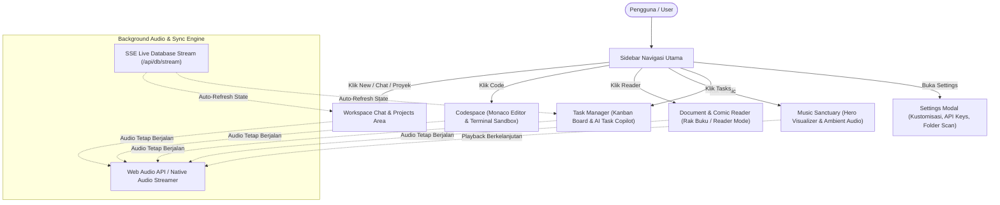
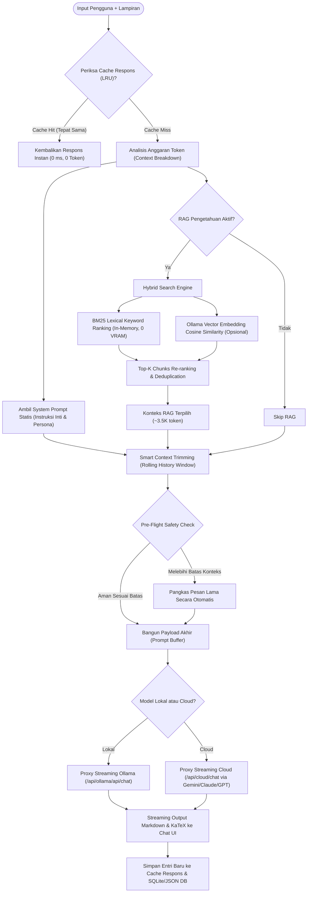
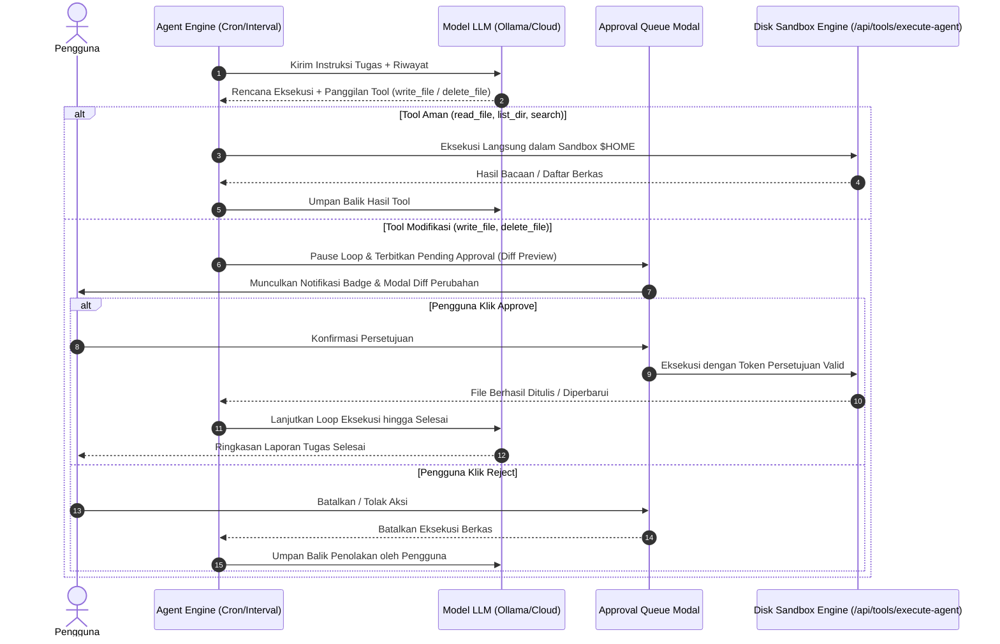
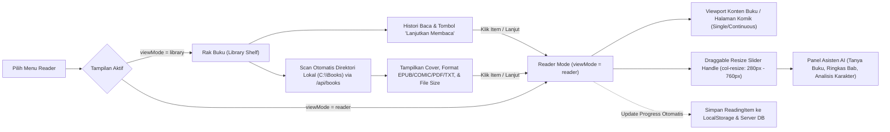

# 🦙 Ollama Studio: Autonomous AI Workspace & Agent Hub

<p align="center">
  
</p>

<p align="center">
  <strong>Modern, Local-First, Privacy-Focused AI Workspace, Autonomous Agent Hub & Productivity Suite.</strong>
  <br />
  <em>Dirancang untuk model lokal (Ollama / GGUF) dan Cloud AI (Gemini, Claude, GPT, DeepSeek, Groq, OpenRouter). Dilengkapi Smart Context, Hybrid RAG, In-Browser Codespace, Document & Comic Reader, Offline Music Sanctuary, Kanban Task Manager, serta Human-in-the-Loop Security Sandbox.</em>
</p>

<p align="center">
  
  
  
  
  
  
  
</p>

---

## 📑 Daftar Isi

- [🌟 Sorotan Fitur Utama](#-sorotan-fitur-utama)
- [🔄 Alur Kerja Web UI (Workflow Diagrams)](#-alur-kerja-web-ui-workflow-diagrams)
  - [1. Arsitektur Viewport & Navigasi Utama](#1-arsitektur-viewport--navigasi-utama)
  - [2. Alur Prompt Engine, Smart Context & Hybrid RAG](#2-alur-prompt-engine-smart-context--hybrid-rag)
  - [3. Alur Agen Otonom & Human-in-the-Loop Tool Approval](#3-alur-agen-otonom--human-in-the-loop-tool-approval)
  - [4. Alur Rak Buku & Document Reader](#4-alur-rak-buku--document-reader)
- [✨ Rincian Fitur Komprehensif](#-rincian-fitur-komprehensif)
  - [1. Smart Context, Context Shift & Visualizer](#1-smart-context-context-shift--visualizer)
  - [2. Autonomous Agents, Scheduler & Approval Queue](#2-autonomous-agents-scheduler--approval-queue)
  - [3. Full-Screen Codespace & Live Preview](#3-full-screen-codespace--live-preview)
  - [4. Document & Comic Reader (Rak Buku & AI Slider)](#4-document--comic-reader-rak-buku--ai-slider)
  - [5. Dedicated Music Sanctuary & Focus Soundscapes](#5-dedicated-music-sanctuary--focus-soundscapes)
  - [6. Manajemen Task Kanban & AI Copilot](#6-manajemen-task-kanban--ai-copilot)
  - [7. Disk Tools Sandbox & Diff Preview](#7-disk-tools-sandbox--diff-preview)
  - [8. Claude-Style Projects & Custom Personas](#8-claude-style-projects--custom-personas)
  - [9. Penyimpanan Ganda (SQLite WAL + JSON Fallback + SSE)](#9-penyimpanan-ganda-sqlite-wal--json-fallback--sse)
- [🔐 Keamanan & Sandbox Akses](#-keamanan--sandbox-akses)
- [🚀 Panduan Instalasi & Memulai](#-panduan-instalasi--memulai)
- [⚙️ Variabel Lingkungan (.env.local)](#️-variabel-lingkungan-envlocal)
- [⌨️ Pintasan & Perintah Slash (/slash)](#️-pintasan--perintah-slash-slash)
- [📁 Struktur Direktori](#-struktur-direktori)
- [🧪 Pengujian (Testing)](#-pengujian-testing)
- [📄 Lisensi](#-lisensi)

---

## 🌟 Sorotan Fitur Utama

- 🔒 **100% Privat & Local-First**: Chat, e-book, musik, task, konfigurasi agen, dan berkas proyek tersimpan aman di mesin lokal Anda tanpa ketergantungan cloud.
- ⚡ **Smart Context & Zero-VRAM Hybrid RAG**: Alokasi konteks cerdas dengan BM25 keyword matching secepat kilat + semantic vector embeddings opsional, lengkap dengan sistem *Context Shift*, cache prompt statis, dan LRU response cache.
- 📚 **Document & Comic Reader + Rak Buku**: Baca EPUB, PDF, Text/Markdown, serta Manga/Komik (CBZ & CBR) dengan panel asisten AI yang dapat digeser (`col-resize`), histori baca otomatis, dan fitur scan folder lokal tanpa perlu upload satu per satu.
- 🎵 **Dedicated Music Sanctuary**: Stasiun musik layar penuh dengan *hero audio visualizer*, pemindai berkas lagu lokal (`.mp3`, `.flac`, `.wav`), dan 6 suara ambien offline (Lofi, Rain, Space, Synthwave, Forest, 432Hz Binaural) yang terus berputar saat Anda berpindah menu.
- ✅ **Task Management Kanban & AI Copilot**: Manajemen tugas gaya Kanban (*To Do*, *In Progress*, *Review*, *Done*) dan List View, lengkap dengan asisten AI untuk memecah subtask otomatis, membuat draft solusi kode, dan tombol langsung kirim ke chat.
- 💻 **In-Browser Codespace**: Editor multi-tab terintegrasi Monaco Editor, terminal emulator, dan sandbox eksekusi HTML/SVG live preview.
- ⏰ **Autonomous Background Agents**: Penjadwal cron/interval otomatis untuk riset berkala dengan sistem verifikasi keamanan *Human-in-the-Loop* (diff viewer sebelum mengeksekusi penulisan berkas).
- 🎨 **Kustomisasi Luas**: 13 tema warna (Claude Amber, OLED Black, Midnight, Dracula, Cyberpunk, Custom Palette), kontrol ukuran font, dan modal pengaturan yang lapang (*max-w-6xl*).

---

## 🔄 Alur Kerja Web UI (Workflow Diagrams)

Berikut adalah diagram alur kerja utama aplikasi dari sisi navigasi antarmuka, pemrosesan konteks AI, hingga eksekusi alat dan agen.

### 1. Arsitektur Viewport & Navigasi Utama

Aplikasi menggunakan sistem navigasi multi-viewport responsif yang beroperasi di atas satu tab browser:



---

### 2. Alur Prompt Engine, Smart Context & Hybrid RAG

Setiap kali pesan dikirim, sistem menjalankan evaluasi multi-layer sebelum meneruskan permintaan ke runtime LLM (Ollama atau Cloud):



---

### 3. Alur Agen Otonom & Human-in-the-Loop Tool Approval

Agen otonom berjalan di background untuk tugas terjadwal atau otomatisasi berantai. Tindakan sensitif disk diproteksi dengan antrean persetujuan pengguna:



---

### 4. Alur Rak Buku & Document Reader



---

## ✨ Rincian Fitur Komprehensif

### 1. Smart Context, Context Shift & Visualizer
- **Visualizer Konteks Real-Time**: Widget interaktif yang memperlihatkan alokasi token secara transparan (System Core, Ephemeral RAG, Disk Tools Schema, Riwayat Chat, dan Ruang Output).
- **Context Shift / KV Memory Retention**: Menghindari pembacaan ulang history dari awal saat percakapan berlanjut.
- **Static System Prompt Caching**: Kontrak aturan sistem di-cache pada tingkat memori untuk menghemat kuota konteks harian.
- **LRU Response Cache**: Pertanyaan umum atau query berulang dijawab seketika (0 ms) tanpa membebani GPU atau token cloud.

### 2. Autonomous Agents, Scheduler & Approval Queue
- **Penjadwal Fleksibel**: Jalankan agen secara periodik (setiap X menit/jam) atau ekspresi Cron.
- **Multi-Step Tool Orchestration**: Agen mampu mencari file di disk, membaca konten, merangkum, dan mengusulkan modifikasi kode.
- **Diff Preview Approval Modal**: Setiap aksi `write_file` menampilkan visual diff sebelum disetujui, memastikan berkas proyek Anda tetap aman dari kesalahan agen.

### 3. Full-Screen Codespace & Live Preview
- **Monaco Code Editor**: Editor kode tingkat industri langsung di peramban dengan penyorotan sintaks TypeScript, Python, HTML/CSS, JSON, dan Markdown.
- **Virtual Terminal Emulator**: Uji logika JavaScript dan perintah konsol secara lokal.
- **Sandboxed Live Preview**: Pratinjau komponen UI (HTML5 Canvas, SVG, Tailwind, dan animasi CSS) secara real-time di dalam iframe berpasir (*sandboxed*).

### 4. Document & Comic Reader (Rak Buku & AI Slider)
- **Multi-Format Reader**: Mendukung format `.epub` (buku teks & novel), `.cbz` & `.cbr` (komik dan manga Jepang dengan mode halaman ganda/kontinyu), `.pdf`, serta `.txt`/`.md`.
- **Rak Buku & Histori Baca**: Cover kartu visual, persentase progres membaca, waktu baca terakhir, dan tombol *Lanjutkan Membaca*.
- **Auto-Scan Folder Lokal**: Cukup daftarkan folder lokal Anda (misal `C:\Books`), aplikasi otomatis mengindeks seluruh koleksi tanpa repot upload manual.
- **Slider Asisten AI**: Panel asisten AI dapat diubah lebarnya secara bebas (280px hingga 760px) menggunakan mouse slider handle.

### 5. Dedicated Music Sanctuary & Focus Soundscapes
- **Stasiun Musik Layar Penuh**: Hero visualizer dengan piringan hitam animasi, pemutar musik offline, dan pengatur volume master.
- **Suara Ambien Web Audio API**: 6 soundscape sintetis 100% offline (Lofi Coffeehouse, Midnight Rain & Thunder, Deep Space Drone, Cyberpunk City Nights, Forest Birds, 432Hz Alpha Waves).
- **Pemindai Musik Disk**: Scan berkas lagu di direktori komputer (`.mp3`, `.flac`, `.wav`, `.m4a`) dengan streaming audio berlatensi rendah.
- **Background Playback**: Musik terus mengalun saat berpindah ke menu lain (Chat, Codespace, Reader, Tasks).

### 6. Manajemen Task Kanban & AI Copilot
- **Papan Kanban Visual**: 4 status kolom (*To Do*, *In Progress*, *Review*, *Done*) dengan warna prioritas (*Urgent*, *High*, *Medium*, *Low*).
- **Tampilan Daftar (List View)**: Tabel padat untuk menyortir task berdasarkan tenggat waktu, proyek, atau tag.
- **AI Task Copilot**:
  - *Auto-Breakdown*: Mengurai judul task kompleks menjadi daftar checklist subtask secara otomatis.
  - *Draft Solusi & Kode*: Menyusun rencana teknis dan kode implementasi dengan 1 klik.
  - *Kirim ke Chat*: Langsung menyalin solusi yang dibuat agen ke area chat utama.

### 7. Disk Tools Sandbox & Diff Preview
- Mengizinkan model AI membaca dan memodifikasi file di mesin pengguna dengan batasan keamanan ketat di direktori pengguna (`$HOME`).
- Tool yang tersedia: `read_file`, `write_file`, `list_directory`, `search_files`, `delete_file`.
- Menampilkan visual diff per baris sebelum modifikasi file dijalankan.

### 8. Claude-Style Projects & Custom Personas
- **Proyek Terisolasi**: Pisahkan instruksi sistem, berkas pengetahuan, hyperparameter (`temperature`, `top_p`, `num_ctx`), dan riwayat obrolan per proyek.
- **Direktori Skill & Plugin**: Aktifkan persona spesialis (Staff Software Architect, Cybersecurity Analyst, Data Scientist, Technical Writer) yang secara otomatis menyalakan disk tool yang relevan.

### 9. Penyimpanan Ganda (SQLite WAL + JSON Fallback + SSE)
- Menggunakan database **SQLite** berperforma tinggi dengan mode WAL (`better-sqlite3`).
- Jika mesin pengguna belum memiliki kompiler C++/Python untuk SQLite natif, sistem otomatis beralih ke fallback **JSON Flat File** (`data/db.json`) dengan API identik tanpa error.
- **Server-Sent Events (SSE)** via `/api/db/stream` memperbarui perubahan data secara instan di semua tab peramban.

---

## 🔐 Keamanan & Sandbox Akses

| Route API | Kemampuan & Batasan Keamanan |
| :--- | :--- |
| `/api/fs`, `/api/tools/execute*` | Operasi berkas disk dibatasi ketat di direktori `$HOME` pengguna via sandbox `pathSandbox.ts`. Tindakan `write_file` dan `delete_file` dari agen wajib menyertakan token persetujuan pengguna. |
| `/api/books` | Mengindeks dan melakukan streaming berkas buku lokal secara aman dengan validasi whitelist ekstensi berkas. |
| `/api/audio` | Streaming berkas lagu lokal dari folder yang dikonfigurasi dengan whitelist ekstensi audio. |
| `/api/cloud/chat` | Masking otomatis data rahasia (`lib/redaction.ts`) sebelum data dikirim ke penyedia cloud (OpenAI/Anthropic/Gemini). |
| `/api/ollama/[...path]` | Rate-limiting proxy untuk mencegah looping berlebih pada instance Ollama lokal. |

Gunakan token keamanan jika membuka aplikasi ke jaringan lokal (LAN) atau tunnel publik:

```bash
# .env.local
APP_ACCESS_TOKEN=your_secure_generated_token_here
NEXT_PUBLIC_APP_ACCESS_TOKEN=your_secure_generated_token_here
```

---

## 🚀 Panduan Instalasi & Memulai

### Prasyarat
- **Node.js**: v18.0.0 atau lebih tinggi (disarankan Node LTS).
- **Ollama**: Terpasang dan berjalan di komputer lokal ([Unduh Ollama](https://ollama.com/)).

### Langkah Instalasi

1. **Clone Repository**:
   ```bash
   git clone https://github.com/p3nr0s3/ollama-chat-web.git
   cd ollama-chat-web
   ```

2. **Install Dependensi**:
   ```bash
   npm install
   ```

3. **Siapkan Berkas Lingkungan**:
   ```bash
   cp .env.example .env.local
   ```

4. **Jalankan Layanan Ollama**:
   Buka terminal terpisah, lalu unduh model pilihan Anda:
   ```bash
   ollama serve
   ollama pull qwen2.5-coder:7b      # Contoh model koding
   ollama pull gemma2:9b             # Contoh model percakapan
   ollama pull nomic-embed-text      # Model embeddings untuk Semantic RAG
   ```

5. **Jalankan Aplikasi Web**:
   ```bash
   npm run dev
   ```

6. **Buka di Browser**:
   Kunjungi [http://localhost:3000](http://localhost:3000) pada peramban web Anda.

---

## ⚙️ Variabel Lingkungan (.env.local)

Berikut adalah variabel yang dapat Anda sesuaikan di `.env.local`:

```ini
# Port & URL Ollama Lokal
OLLAMA_URL=http://127.0.0.1:11434

# Token Akses Keamanan (Wajib jika menggunakan LAN / Tunnel)
APP_ACCESS_TOKEN=
NEXT_PUBLIC_APP_ACCESS_TOKEN=

# Cloud AI API Keys (Opsional - dapat juga diatur via Settings UI)
GEMINI_API_KEY=
ANTHROPIC_API_KEY=
OPENAI_API_KEY=
GROQ_API_KEY=
DEEPSEEK_API_KEY=
OPENROUTER_API_KEY=

# SearXNG Web Search Engine (Opsional untuk /search)
SEARXNG_URL=
```

---

## ⌨️ Pintasan & Perintah Slash (/slash)

| Perintah | Deskripsi Aksi | Contoh Penggunaan |
| :--- | :--- | :--- |
| `/search` | Pencarian web real-time melalui SearXNG | `/search dokumentasi terbaru Next.js 15` |
| `/think` | Mengaktifkan mode penalaran berantai mendalam (Chain-of-Thought) | `/think analisis celah keamanan arsitektur ini` |
| `/code` | Format output bersih berstandar clean-code arsitektur perangkat lunak | `/code buat algoritma A* pathfinding di TypeScript` |
| `/summarize`| Merangkum teks panjang ke dalam poin-poin terstruktur | `/summarize <teks panjang>` |
| `/blender` | Generator skrip 3D prosedural Python untuk Blender MCP | `/blender studio lighting dengan low-poly donut` |
| `/github`  | Mengambil data issue dan metrik repository GitHub langsung | `/github issues facebook/react` |
| `/slack`   | Mengirimkan payload notifikasi ke webhook channel Slack | `/slack deploy ke staging berhasil` |
| `/discord` | Mengirimkan pesan webhook ke server Discord | `/discord briefing agen harian selesai` |

---

## 📁 Struktur Direktori

```
ollama-chat-web/
├── app/
│   ├── api/
│   │   ├── audio/route.ts               # Streaming audio & scan direktori musik lokal
│   │   ├── books/route.ts               # Streaming biner & scan folder e-book/komik lokal
│   │   ├── cloud/chat/route.ts          # Streaming proxy API Gemini/Claude/OpenAI/Groq/DeepSeek
│   │   ├── connectors/route.ts          # Dispatcher MCP (GitHub, Slack, Discord, Blender)
│   │   ├── db/route.ts                  # Endpoint CRUD database SQLite / JSON
│   │   ├── db/stream/route.ts           # Server-Sent Events (SSE) live database watcher
│   │   ├── fs/route.ts                  # Sandboxed file explorer untuk sistem lokal
│   │   ├── ollama/[...path]/            # Proxy streaming transmisi Ollama lokal
│   │   ├── search/route.ts              # Integrasi mesin pencari SearXNG
│   │   └── tools/                       # Eksekutor disk tools (manual chat & background agent)
│   ├── globals.css                      # Tailwind, KaTeX, font typography & definisi tema CSS
│   ├── layout.tsx                       # Root layout & penyedia konteks tema
│   └── page.tsx                         # Controller utama, pengatur viewport, & state sentral
├── components/                          # Koleksi komponen UI modular (~28 komponen)
│   ├── CodespaceView.tsx                # Layar penuh Codespace editor & terminal
│   ├── DocumentReaderView.tsx           # Layar penuh Reader, Rak Buku, & slider asisten AI
│   ├── MusicFullView.tsx                # Layar penuh Music Sanctuary & visualizer hero
│   ├── MusicPlayerWidget.tsx            # Floating widget pemutar suara ambien offline
│   ├── TaskManagerView.tsx              # Layar penuh Kanban board & AI Task Copilot
│   ├── SettingsModal.tsx                # Dialog pengaturan komprehensif (lebar 6xl)
│   ├── Sidebar.tsx                      # Sidebar navigasi vertikal responsif
│   └── ...
├── lib/                                 # Logika bisnis, algoritma, ranker, & adaptor penyimpanan
│   ├── bookUtils.ts                     # Parser tipe & MIME berkas buku/komik
│   ├── contextVisualizer.ts             # Algoritma pembagi alokasi token konteks
│   ├── diskToolOps.ts                   # Implementasi operasi sandboxed berkas disk
│   ├── rag.ts                           # BM25 token ranker + hybrid semantic retrieval
│   ├── responseCache.ts                 # Cache respons cerdas LRU (0 ms latency)
│   ├── serverDb.ts                      # Abstraksi database SQLite WAL dengan JSON fallback
│   ├── storage.ts                       # Adapter sinkronisasi localStorage & server DB
│   └── types.ts                         # Definisi TypeScript komprehensif
└── tests/                               # 10 test suite Vitest (Sandbox, RAG, Parser, DB, Task, Books)
```

---

## 🧪 Pengujian (Testing)

Proyek ini dilengkapi dengan suite pengujian otomatis menyeluruh berbasis **Vitest**:

```bash
# Menjalankan seluruh pengujian unit
npm run test

# Menjalankan pemeriksaan tipe TypeScript tanpa kompilasi
npx tsc --noEmit

# Memeriksa build produksi Next.js
npm run build
```

Semua 10 file pengujian mencakup:
- Validasi sandbox keamanan jalur berkas (*Path Traversal Protection*).
- Algoritma pemeringkat hibrida RAG (BM25 + Cosine Similarity).
- Parser e-book (EPUB, PDF, CBZ/CBR Comic).
- Smart Context trimming & alokasi anggaran token.
- LRU Response Cache hit/miss.
- Text diff generator untuk persetujuan tool modifikasi berkas.
- Logika Task Manager (Kanban filtering, status transitions, subtask progress) & Reading Library.

---

## 📄 Lisensi

Didistribusikan di bawah **Lisensi MIT**. Silakan lihat berkas `LICENSE` untuk informasi selengkapnya.

---

<p align="center">
  Dibuat untuk kedaulatan data dan produktivitas komputasi AI lokal terbaik. 🚀
</p>
